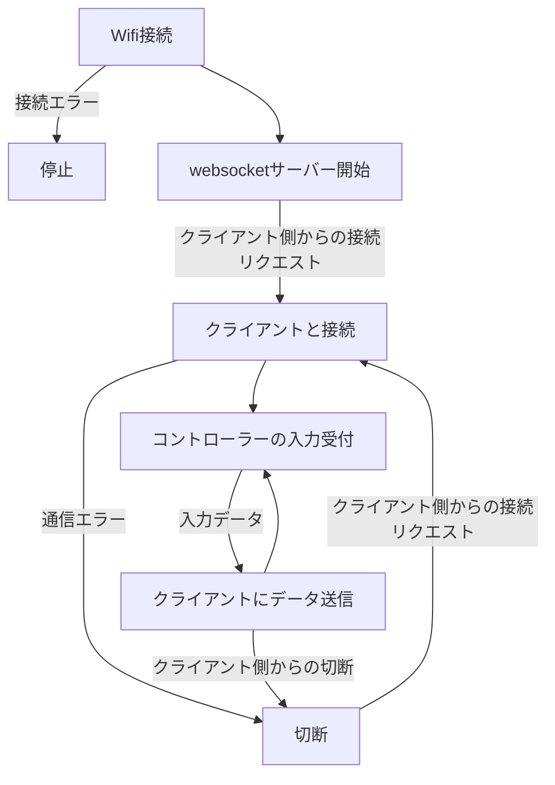
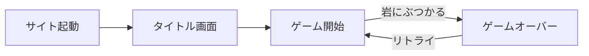

# 研修卒業制作2025

## 概要

Arduino UNO R4 Wifiを用いたwebsocket通信とそれによるデータ通信でプレイ可能なブラウザゲーム<br>
通信でコントローラーの操作情報を送り、赤い車を操作して岩を躱しつづけた時間でスコアが決定する<br>
HTMLはGoogle Chromeでのみ動作確認済<br>
実際にR4Wifiの中で使われているソースファイルは全て```gameproject3```フォルダ内に入っており、HTML、CSS、JSの内容を分かりやすくそれぞれのファイルにまとめたものが```data```フォルダに入っている

<br>
<br>

<br>
**GitHubリポジトリのQRコード**

## 仕様

### ハードウェア

<br>
回路接続イメージ

<br>

<br>
回路図

<br>

使用モジュール

* Arduino UNO R4 Wifi
* ジョイスティックモジュール
* ボタン×4
* 10k抵抗×4
* 104mFセラミックコンデンサ×4

### ソフトウェア

ざっくりしたプログラムフローチャート



### ゲーム

<br>
サイトの最初の画面

<br>

<br>
実際にプレイしている画面

<br>

<br>
ゲームオーバー画面

<br>

場面遷移図



<br>

* dataフォルダ内の```game1.html```をブラウザで開くとメインの画面が表示される
* サイトの画面にはゲーム画面とUIの二つがある
* ゲーム画面をクリックすると音が流れ始める
* サイトの```接続開始```ボタンをクリックすることでwebsocket通信が始まる
* 通信によるコントローラーの接続が成功すると、ゲームが始まりアニメーションがスタート
* 3秒のカウントダウンの後、岩や草が上から流れてくる
* スコア800点毎にレベルが上がる
* レベルが上がる毎に岩や草の流れるスピードが速くなっていく
* ```Aボタン```（R4Wifiの5番PINに接続されたボタン）を押しながらジョイスティックを倒すことで移動速度が一時的に向上する
* 草は当たっても問題ないが、岩は当たると車が破壊されゲームオーバーとなる
* ゲームオーバー後は```Bボタン```（R4Wifiの4番PINに接続されたボタン）を押すことでリトライが可能
* サイトのリロードはArduino側のリセットボタン
