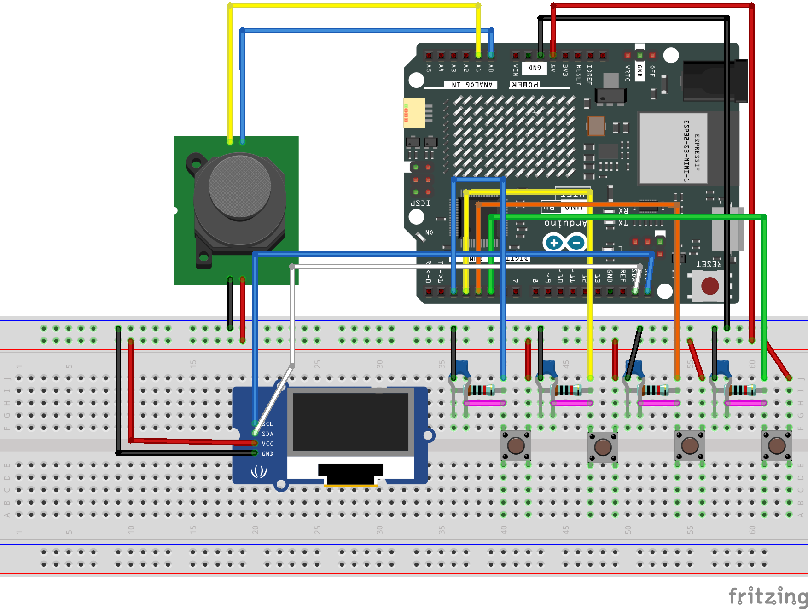
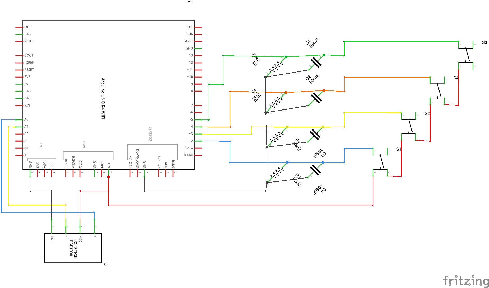
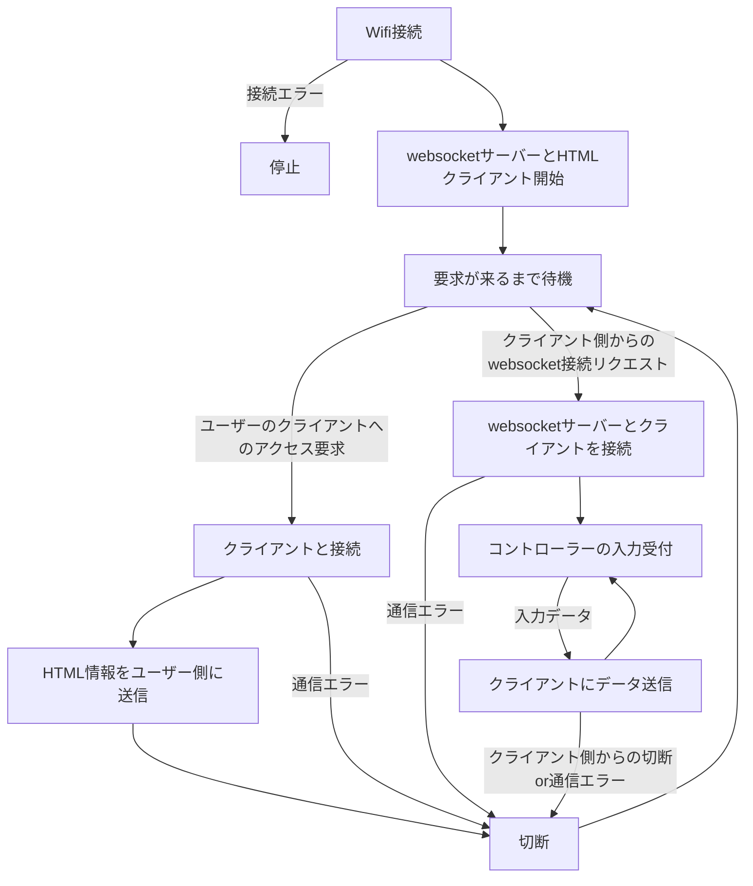
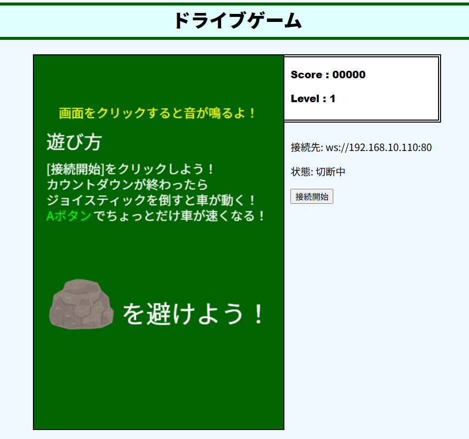
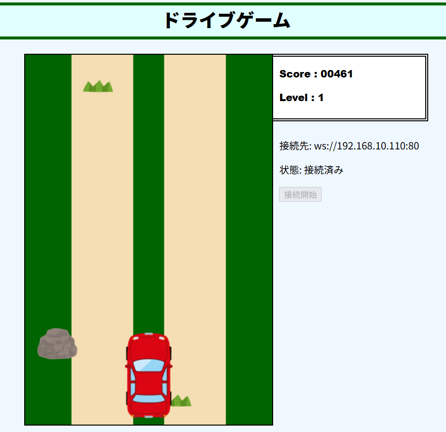
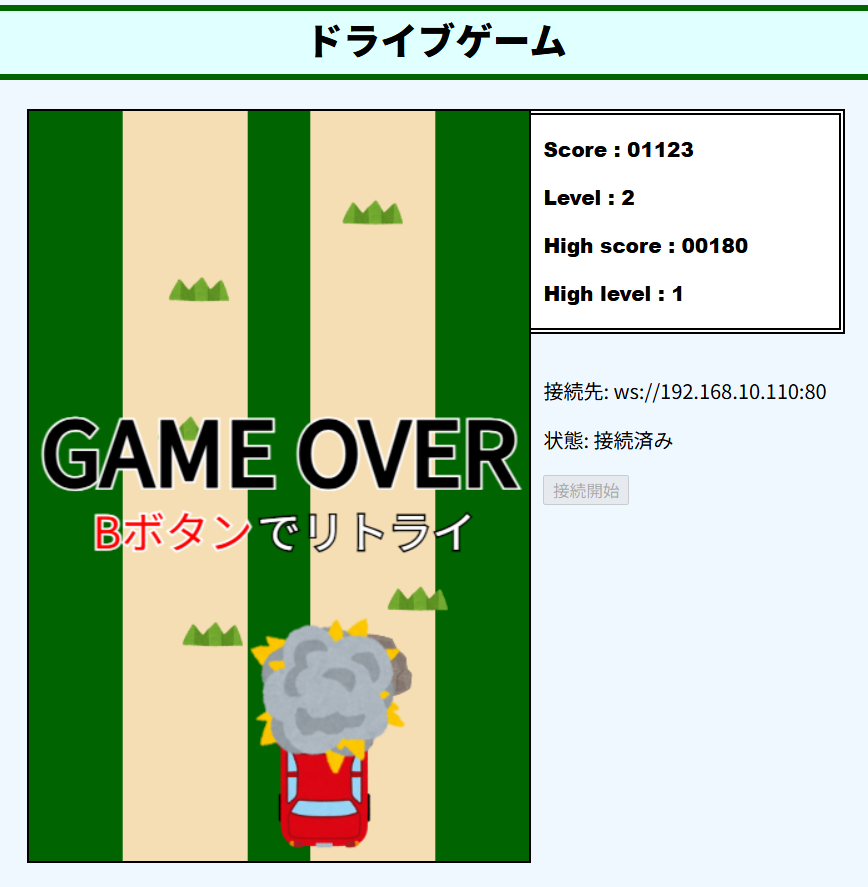
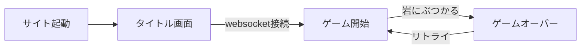

# 研修卒業制作2025

## デモ動画

https://github.com/user-attachments/assets/fd38c4d3-cdd7-4f2d-8694-92691fb51926

## 概要

Arduino UNO R4 Wifiを用いたwebsocket通信とクライアントサーバーの構築及びそれによるデータ通信でプレイ可能なブラウザゲーム<br>
通信でコントローラーの操作情報を送り、赤い車を操作して岩を躱しつづけた時間でスコアが決定する<br>
Google Chromeでのみ動作確認済<br><br>
実際にR4WiFiの中で使われているソースファイルは全て```gameproject3```フォルダ内に入っており、HTML、CSS、JSの内容を分かりやすくそれぞれのファイルにまとめたものが```data```フォルダに入っている

<br>

<br>
**プロジェクトのGitHubリポジトリのQRコード**<br>
https://github.com/fanofJOTARO/2025TrainingGraduationProject

## 実際に動作させる方法

### 事前準備

1. 本資料のブレッドボード画像と回路図接続の画像を参考に回路を組む
2. リポジトリから```gameproject3```フォルダをダウンロード（リポジトリごとでもOK）

### セットアップ方法

1. フォルダ内の```gameproject3.ino```をArduino IDEで開く
2. ```arduino_secrets.h```の```SECRET_SSID```と```SECRET_PASS```を自分が使用しているWi-Fiの2.4GHz帯のものに書き換える
3. PCに自身のR4WiFiをUSB接続しビルドと書き込みを行う
4. リセットボタンを押し、OLEDに表示されたURLにアクセス<br>例：```http://192.168.XXX.XXX:81```

## 仕様

### ハードウェア

<br>
回路接続イメージ

<br>

<br>
回路図

<br>

使用モジュール

|部品|個数|用途|接続PIN|
|---|---|---|---|
|Arduino UNO R4 Wifi|1個|マイコン|USB-TypeC|
|ジョイスティック　QYF-860|1個|ゲーム操作|VCC : 5V<br>GND : GND<br>X : A0<br>Y : A1|
|OLED　GM009605|1個|接続URL表示|VCC : 5V<br>GND : GND<br>SDA : SDA<br>SCK : SCL|
|ボタン **※1**|4個|ゲーム操作用<br>ABXYボタン|A : D5<br>B : D4<br>X : D2<br>Y : D3|
|10kΩ抵抗|4個|ボタンの抵抗|各種ボタン|
|104μFセラミックコンデンサ|4個|ボタンのチャタリング防止|各種ボタン|

> ※1<br>
> 本プロジェクトで使用しているボタンはAボタン、Bボタンの二つだけのため、このプロジェクトを動かすだけであればそれ以外のボタンは接続する必要がない

### ソフトウェア

#### 使用ライブラリ

* Wi-Fi接続
  * [WiFiS3](https://docs.sunfounder.com/projects/elite-explorer-kit/ja/latest/iot_projects/01_iot_webserver.html)
* JSONファイル処理
  * [ArduinoJson](https://arduinojson.org/?utm_source=meta&utm_medium=library.properties)
* OLED
  * [Adafruit SSD1306](https://github.com/adafruit/Adafruit_SSD1306)
  * [Adafruit GFX](https://github.com/adafruit/Adafruit-GFX-Library)
  * [SPI](https://github.com/arduino/ArduinoCore-avr/tree/master/libraries/SPI)
  * [Wire](https://github.com/arduino/ArduinoCore-avr/tree/master/libraries/Wire)
  
#### 以下追加ファイル

* Wi-Fi接続
  * arduino_secrets.h
* websocketサーバー
  * sha1.h
  * sha1.cpp
  * base64.h
  * base64.cpp
* ゲーム記述
  * gamepageHTML.h
  * gamepageJS.h
  * gamepageCSS.h

<br>**Wi-Fi接続**<br>
Wi-FiのSSIDとパスワードを自身の使用するものに書き換える必要がある。<br>
また、つなぐWi-Fiの周波数帯は2.4GHzを使用すること。<br>
<br>
**websocketキー生成**<br>
本プロジェクトで使用しているR4WiFiでは満足に動かせるwebsocket通信ライブラリが存在しなかったため、ローカル側で独自にキー生成からサーバー設立、受信、送信を行い通信を確立させている。<br>
<br>
**ゲーム記述**<br>
今回のプロジェクトではクライアントサーバーのユーザーインターフェース及びゲームそのものをHTML、CSS、JavaScriptで記述したかったため、R4WiFiがサーバー上に記述するために用意したヘッダーファイルである。<br>
記述内容はHTML、CSS、JavaScriptを文字列としてdefine変数に格納しメインのソースファイルで読み込めるようにしたもの。

**ざっくりしたプログラムフローチャート**<br>



### ゲーム

<br>
サイトの最初の画面
<br>

<br>
実際にプレイしている画面
<br>

<br>
ゲームオーバー画面
<br>

場面遷移図



<br>

* サイトの画面にはゲーム画面とUIの二つがある
* ゲーム画面をクリックすると音が流れ始める
* サイトの```接続開始```ボタンをクリックすることでwebsocket通信が始まる
* 通信によるコントローラーの接続が成功すると、ゲームが始まりアニメーションがスタート
* 3秒のカウントダウンの後、岩や草が上から流れてくる
* スコア800点毎にレベルが上がる
* レベルが上がる毎に岩や草の流れるスピードが速くなっていく
* ```Aボタン```（R4WiFiの5番PINに接続されたボタン）を押しながらジョイスティックを倒すことで移動速度が一時的に向上する
* 草は当たっても問題ないが、岩は当たると車が破壊されゲームオーバーとなる
* ゲームオーバー後は```Bボタン```（R4WiFiの4番PINに接続されたボタン）を押すことでリトライが可能
* リトライするとき現在スコアが記録されているハイスコアより高かった時にハイスコアが更新される。
* サイトのリロードはArduino側のリセットボタン

## 使用素材クレジット

* 車、岩、草、爆発の画像　[いらすとや](https://www.irasutoya.com/)
* 各種音源　[PANICPUMPKIN](https://pansound.com/panicpumpkin/index.html)
